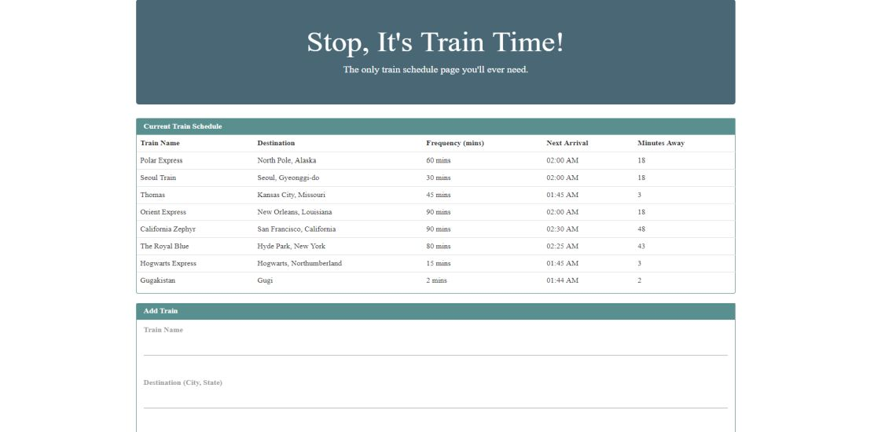

# Train_Activity

Heres how the App works:
 

You can add trains with the following info: Train Name Destination First Train Time -- in military time Frequency -- in minutes
 

This app will calculate when the next train will arrive; this should be relative to the current time.
 

Using Firebase users from many different machines will be able to view the same train times.
 
